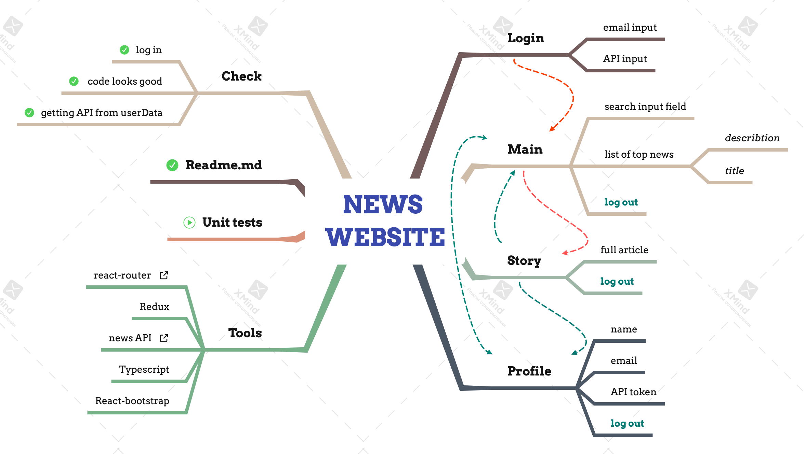

# News Website
News website example with Typescript, React and Redux

## Mind map workflow

## Description

Simple News Website with 4 pages - Login, Main, Story and Profile views.

There is a hand-made pagination at the bottom of the page.

What needs to be added in the future? Tests, more fitable Pagination. And put Navigation in a separate component.

## How to use
* `git clone` this repository;
* `yarn install` all dependencies;
*  type `yarn start`, if you want to run app;
